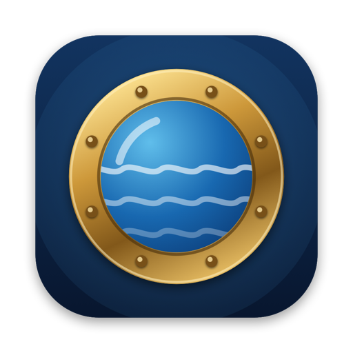
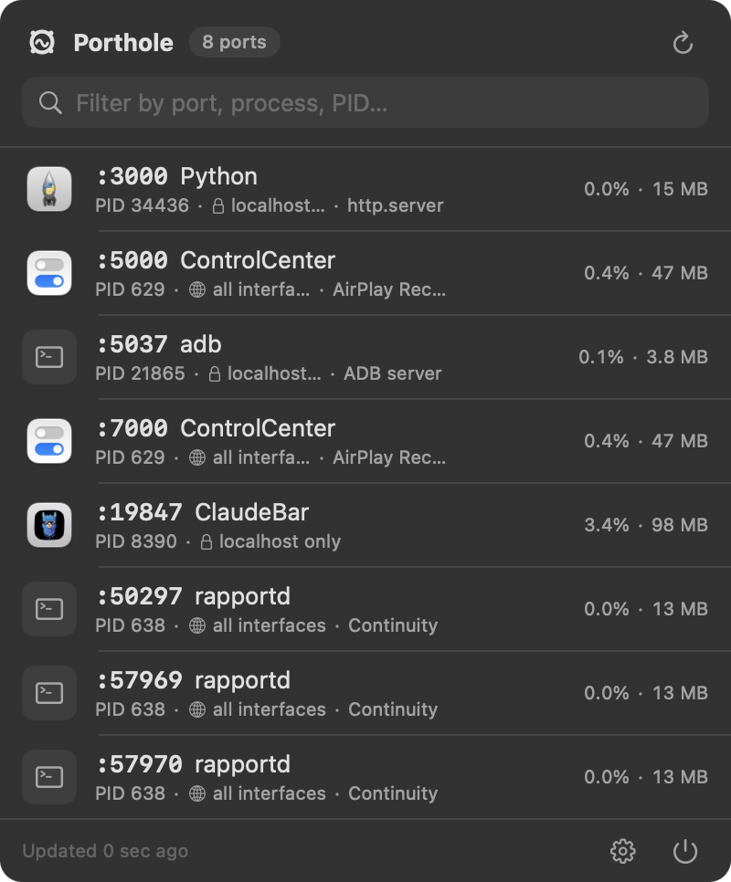
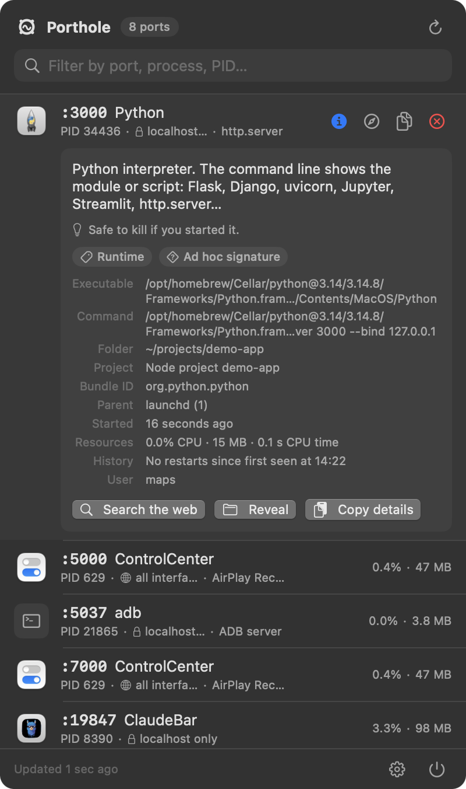

<p align="center">
  
</p>

<h1 align="center">Porthole</h1>

<p align="center">
  See who is listening on your Mac's ports, understand what it is, open it or kill it. From the menu bar.
</p>

<p align="center">
  
  &nbsp;&nbsp;
  
</p>

Native Swift and SwiftUI, no dependencies, about 2 MB. Requires macOS 14 or newer.

## What it does

- **Lives in the menu bar** with a live badge of how many ports are open. 
- **Lists every listener** of your processes (everything, when run as root). TCP by default, UDP as an opt-in.
- **Each row** shows the port, the process name and icon, PID, whether it is bound to localhost only or to all interfaces, the owner when it is not you, and a hint for well-known ports and tools: Vite, Next.js, PostgreSQL, Ollama, AirPlay, Metro, Jupyter… For interpreters it names the script, so `python -m http.server` shows as *http.server*.
- **CPU and memory** per process at the right edge of each row, measured between scans like Activity Monitor does. Sort by port, name, memory or CPU.
- **Restart badge**: when a port keeps changing hands between PIDs of the same program (a crashing dev server, a hot reloader in a loop) the row gets an orange counter.
- **Info** (or click the row) explains what the process is. About 90 common daemons, runtimes, databases and apps have written descriptions and advice, for example that ports 5000 and 7000 belong to Control Center's AirPlay Receiver and how to turn it off, or that Docker's backend holds every published container port. Anything else falls back to the app bundle's own name, version and copyright, the Homebrew formula it came from, or the macOS system folder it lives in. The panel also shows who signed the binary, the command line, working directory, detected project (`package.json` name, `Cargo.toml`, `go.mod`…), parent process, start time, resources and history, plus a web search button.
- **Open** the port in your browser, **copy** the URL, **kill** the process (click twice to confirm; hold ⌥ for SIGKILL). For processes owned by another user there is **Kill as admin**, which uses the standard macOS authorization dialog.
- **Right-click** for more: copy port, PID or command line, reveal the executable in Finder, force kill.
- **Filter** by port, process, PID, user, hint or anything in the command line.
- **Settings**: refresh interval, UDP, menu bar count, sort order, launch at login.
- **CLI**: the same binary prints the table with `--list`, or JSON with `--json`.

## Install

### Download

Grab `Porthole.zip` from the [latest release](https://github.com/ayxos/porthole/releases), unzip it and move `Porthole.app` to `/Applications`.

The app is signed ad hoc, not notarized, so the first launch is blocked by Gatekeeper with a message that the app is damaged or from an unidentified developer. Clear the quarantine flag once:

```bash
xattr -d com.apple.quarantine /Applications/Porthole.app
```

Then open it normally. It appears in the menu bar only; there is no Dock icon.

### Homebrew (builds from source, no Gatekeeper warning)

```bash
brew install --HEAD ayxos/tap/porthole
```

The formula lives in [`homebrew/porthole.rb`](homebrew/porthole.rb). Building on your own machine means the app is signed locally, so Gatekeeper never complains.

### Build it yourself

Requires Xcode or the Command Line Tools.

```bash
git clone https://github.com/ayxos/porthole.git
cd porthole
scripts/build.sh --install   # builds dist/Porthole.app, copies it to /Applications and launches it
```

`scripts/build.sh` alone just builds, `--run` builds and launches. The script calls the toolchain's `swiftc` directly instead of `swift build`, so it also works before the Xcode license has been accepted (`sudo xcodebuild -license accept`). It prefers Xcode when present, because on recent SDKs the SwiftUI macro plugin only ships inside Xcode. `Package.swift` is there for editors and for `swift build` once the license is accepted.

## Using it

Click the porthole icon in the menu bar. Hover a row for the action buttons:

| Button | What it does |
| --- | --- |
| ⓘ | Expand the row and explain the process. Clicking the row does the same. |
| Compass | Open `http://localhost:PORT` (or the specific address the process is bound to) in your default browser. |
| Copy | Copy that URL. |
| ⊗ | Kill. The button turns into a red **Kill** confirmation; click it to send SIGTERM, hold ⌥ while clicking for SIGKILL. |

If the kill fails because the process belongs to another user, a **Kill as admin…** link appears. It runs `kill` through macOS's authorization prompt, so you type your password in the system dialog, not in Porthole.

Everything that is text in the info panel can be selected and copied, and **Copy details** puts the whole panel on the clipboard as plain text for pasting into an issue or a chat.

### CLI

```bash
alias ports='/Applications/Porthole.app/Contents/MacOS/Porthole --list'

ports                 # table: PORT PROTO PID USER PROCESS MEM BIND HINT
ports --udp           # include UDP sockets
Porthole --json       # same data as JSON
Porthole --preview    # the popover in a plain window, handy for screenshots
```

Run with `sudo` to see every user's processes.

## How it works

- Sockets are enumerated through `libproc` (`proc_listpids`, `proc_pidinfo`, `proc_pidfdinfo`), the same interface `lsof` uses. A full scan with process metadata takes well under 100 ms and needs no helper binaries.
- Process path, owner, arguments, working directory and resource usage come from `proc_pidpath`, `proc_pidinfo`, `sysctl(KERN_PROCARGS2)` and `proc_pid_rusage`. CPU% is the CPU time consumed between two scans divided by the wall time, so it can exceed 100% for multi-threaded processes, as in Activity Monitor.
- `netstat -anv` is consulted as a supplement to pick up other users' daemons. On macOS 26/27 netstat only reports the kernel socket table when the caller's responsible process has the right privilege, so from inside the app it usually adds nothing; the CLI run from Terminal, or anything run with `sudo`, gets the full picture. When netstat adds nothing Porthole backs off and only retries occasionally.
- Code signatures are read with the Security framework (`SecStaticCodeCreateWithPath`), descriptions come from `Sources/Porthole/ProcessKnowledge.swift`.
- Kill sends `SIGTERM` (or `SIGKILL` with ⌥) with `kill(2)`. On `EPERM` the admin path runs `kill` through `osascript … with administrator privileges`.
- Launch at login uses `SMAppService`; it works once the app lives in `/Applications`.
- While the panel is closed Porthole only rescans every 20 seconds or so to keep the badge current, and not at all if the badge is turned off.

## Privacy

Porthole reads local process information through public macOS APIs and never sends anything anywhere. The only network access is the **Search the web** button, which opens your browser with the process name as the query. No analytics, no update checks.

## Contributing

The easiest and most useful contribution is a description for a process you recognise. Open [`Sources/Porthole/ProcessKnowledge.swift`](Sources/Porthole/ProcessKnowledge.swift), add an entry keyed by the executable name (what Porthole shows in the row), with a one or two sentence summary, a category and, if killing it is a bad idea or there is a cleaner way to stop it, a piece of advice. Port and tool hints for the row's second line live in [`Sources/Porthole/KnownServices.swift`](Sources/Porthole/KnownServices.swift).

To work on the UI, `scripts/build.sh --run` rebuilds and relaunches, and `dist/Porthole.app/Contents/MacOS/Porthole --preview --expand-first` shows the popover in a plain floating window with the first row expanded. `PORTHOLE_DEBUG=1` makes the app print scan and visibility events to stderr.

```
Sources/Porthole/
  PortholeApp.swift        @main, MenuBarExtra scene, menu bar label, --preview window
  PortStore.swift          observable state: scanning, timer, filter, sort, CPU sampling, history, kill, settings
  PortScanner.swift        merges libproc + netstat results, process metadata, ps fallback
  ProcessInspector.swift   libproc socket enumeration, per-process path / cwd / resource usage
  ProcessDetails.swift     info panel data: explanation, code signature, project detection
  ProcessKnowledge.swift   written descriptions of well-known processes
  KnownServices.swift      port / process hints for the row
  Models.swift             ListeningPort
  Format.swift             compact number formatting
  Shell.swift              tiny Process wrapper
  CLI.swift                --list / --json
  MenuBarIcon.swift        template icon drawn with Core Graphics
  Views/                   ContentView, PortRow, ProcessDetailView, FooterView, WindowBridge
Resources/                 Info.plist, AppIcon.icns (generated by scripts/make-icon.swift)
scripts/                   build.sh, make-icon.swift
homebrew/                  formula for a personal tap
.github/workflows/         CI build; tags starting with v publish Porthole.zip as a release
```

## License

[MIT](LICENSE)
